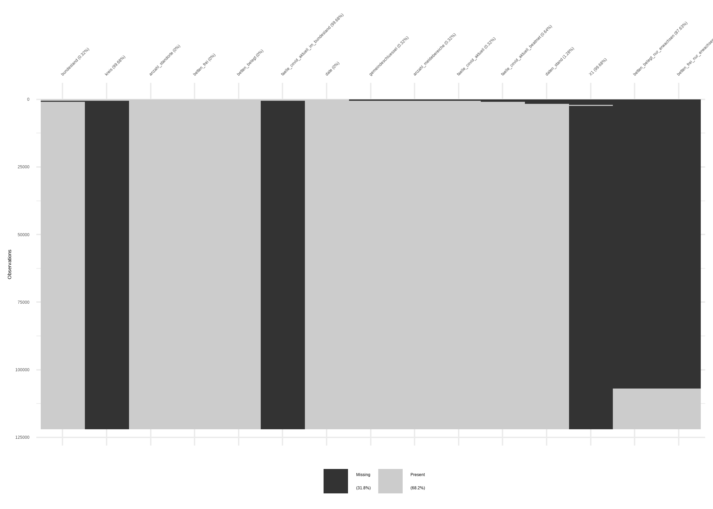

EDA
================
Stephan
2/26/2021

## Data is imported from

Source: <https://edoc.rki.de/handle/176904/7011>

``` r
library(dplyr)
library(ggplot2)
library(readr)
library(purrr)
library(lubridate)
library(patchwork)
library(showtext)
library(stringr)
font_add_google("Roboto Condensed", "conde")
showtext_auto()
theme_set(theme_light(base_family = "conde", base_size = 28))
heute <- format(Sys.Date(), "%b %d, %Y")


icu_files <- list.files(path = "data_raw/", pattern = "csv", full.names = TRUE)
data_raw <- map_df(icu_files, function (x) read_csv(x) %>% 
                     mutate(date = x,
                            date = str_extract_all(date, "[0-9]{4}-[0-9]{2}-[0-9]{2}"),
                            date = ymd(date))
)
```

## EDA of Dataset

``` r
data_raw %>% 
  glimpse()
```

    ## Rows: 120,787
    ## Columns: 15
    ## $ bundesland                         <chr> "01", "01", "01", "01", "01", "0...
    ## $ kreis                              <chr> "01001", "01002", "01003", "0100...
    ## $ anzahl_standorte                   <dbl> 2, 3, 2, 1, 1, 2, 3, 3, 2, 1, 2,...
    ## $ betten_frei                        <dbl> 40, 99, 113, 17, 49, 8, 23, 29, ...
    ## $ betten_belegt                      <dbl> 38, 108, 110, 21, 25, 10, 21, 23...
    ## $ faelle_covid_aktuell_im_bundesland <dbl> 28, 28, 28, 28, 28, 28, 28, 28, ...
    ## $ date                               <date> 2020-04-24, 2020-04-24, 2020-04...
    ## $ gemeindeschluessel                 <chr> NA, NA, NA, NA, NA, NA, NA, NA, ...
    ## $ anzahl_meldebereiche               <dbl> NA, NA, NA, NA, NA, NA, NA, NA, ...
    ## $ faelle_covid_aktuell               <dbl> NA, NA, NA, NA, NA, NA, NA, NA, ...
    ## $ faelle_covid_aktuell_beatmet       <dbl> NA, NA, NA, NA, NA, NA, NA, NA, ...
    ## $ daten_stand                        <dttm> NA, NA, NA, NA, NA, NA, NA, NA,...
    ## $ X1                                 <dbl> NA, NA, NA, NA, NA, NA, NA, NA, ...
    ## $ betten_belegt_nur_erwachsen        <dbl> NA, NA, NA, NA, NA, NA, NA, NA, ...
    ## $ betten_frei_nur_erwachsen          <dbl> NA, NA, NA, NA, NA, NA, NA, NA, ...

``` r
data_raw %>% 
  naniar::vis_miss(warn_large_data = FALSE)
```

<!-- -->

## Data needs cleaning

``` r
data_clean <- data_raw %>% 
  mutate(gemeindeschluessel = if_else(is.na(gemeindeschluessel), kreis, gemeindeschluessel),
         daten_stand = if_else(is.na(daten_stand), as_datetime(date), daten_stand)) %>% 
  select(-kreis, -X1, -faelle_covid_aktuell_im_bundesland, -date)

data_clean %>% 
  naniar::vis_miss(warn_large_data = FALSE) +
  theme_light(base_size = )
```

<!-- -->

## First Exploration Capacity

``` r
g1 <- data_clean %>% 
  select(bundesland, daten_stand, betten_belegt, betten_frei) %>% 
  mutate(occupancy = betten_belegt/(betten_frei+betten_belegt)*100,
         occupancy = round(occupancy, 1)) %>% 
  group_by(daten_stand) %>% 
  summarise(avg_occupancy = mean(occupancy)) %>% 
  ggplot(aes(daten_stand, avg_occupancy, color = "black")) +
  geom_line(size = 1.2) +
  labs(title = "Average bed occupacy of ICU Units",
       subtitle = paste0("Data source @rki, Date: ", heute),
       y = "average occupacy in %",
       x = "date") +
  ggsci::scale_color_lancet(guide = "none")

g2 <- data_clean %>% 
  select(bundesland, daten_stand, betten_belegt, betten_frei) %>% 
  mutate(beds_available = betten_frei+betten_belegt) %>% 
  group_by(daten_stand) %>% 
  summarise(total_bed = sum(beds_available)) %>% 
  ggplot(aes(daten_stand, total_bed, color = "black")) +
  geom_line(size = 1.2) +
  ggsci::scale_color_lancet(guide = "none") +
  labs(title = "Total bed capacity of ICU Units",
       subtitle = paste0("Data source @rki, Date: ", heute),
       y = "total capacity in %",
       x = "date")

g1 / g2
```

<!-- -->
